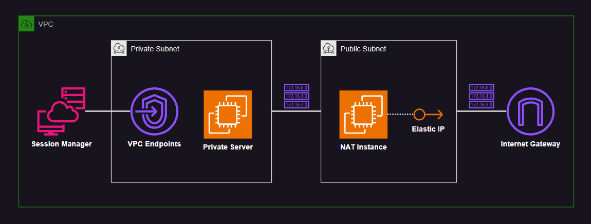

# AWS NAT Instance

Ubuntu NAT instance running on AWS.

> ⚠️ Session Manager is not connecting via current NAT config, need to fix this here.



Create the `.auto.tfvars` with the following:

```terraform
create_private_server = false
create_vpc_endpoints  = false
```

Apply your infrastructure:

```sh
terraform init
terraform apply -auto-approve
```

After creating the resources, confirm that the NAT instance has been set up correctly:

```sh
cloud-init status

ip link show
sysctl -ar ip_forward
```

Now set `create_private_server = true` and apply again.

To test it, connect to the private server using Sessions Manager.

If you wish to enable VPC endpoints, set the variable:

```terraform
create_vpc_endpoints = true
```
